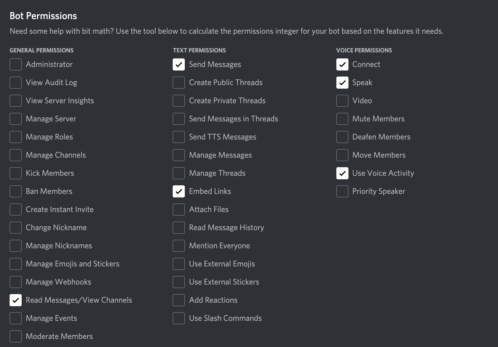

# music-discord-bot
Discord music bot backend to play music from youtube and spotify

# Support
Join my personal discord [server](https://discord.gg/cSuKhuEUtD) for support.

# Bot commands
- !help
- !play url or name
- !add  url or name
- !next
- !pause
- !resume
- !stop
- !clear clears the song queue
- !bass value between -20 to +20
- !treble value between -20 to +20

#### PS: Url can be any youtube video link or any spotify link(song,album,playlist)

# Requirements
- Node >= v16
- Can be downloaded from official node [webpage](https://nodejs.org/en/)

# Setup
- Login to discord developer portal to get your own bot client token
- Invite bot to your server with required server permissions, the url can be generated in discord developer portal. (token is found in Bot tab of your applications and invite url can be found in your oauth>URl generator)
- As this backend uses play-dl, read [instructions](https://github.com/play-dl/play-dl/blob/main/instructions/README.md) on how to authorise your bot to play music from spotify or add youtube cookies.
- Once all the keys are retrieved create a .env file in root directory.
### Example .env file
```
CLIENT_TOKEN=xxxx
CLIENT_ID=xxx
CLIENT_SECRET=xxx
REFRESH_TOKEN=xxx
```
# Minimum bot Permissons


# Running
Run these commands in root directory
- Install dependencies
```
npm install
```
- One can install nodemon globally and use it
```
sudo npm i -g nodemon
```
- Run nodemon in root directory
```
nodemon
```
- The backend can be launched using npm also
```
npm start
```

# Contrbuting guidelines
- Please raise pull requests to development branch
- Helpful git commands can be found in this [website](https://shobhi1310.github.io/contributions/CONTRIBUTING.html)
- If pull requests are raised into main branch they will be rejected
- Please feel free to raise [issues](https://github.com/darahask/music-discord-bot/issues) if you want to improve anything in particular

# Contributors
#### [Darahas Kopparapu](https://github.com/darahask)
